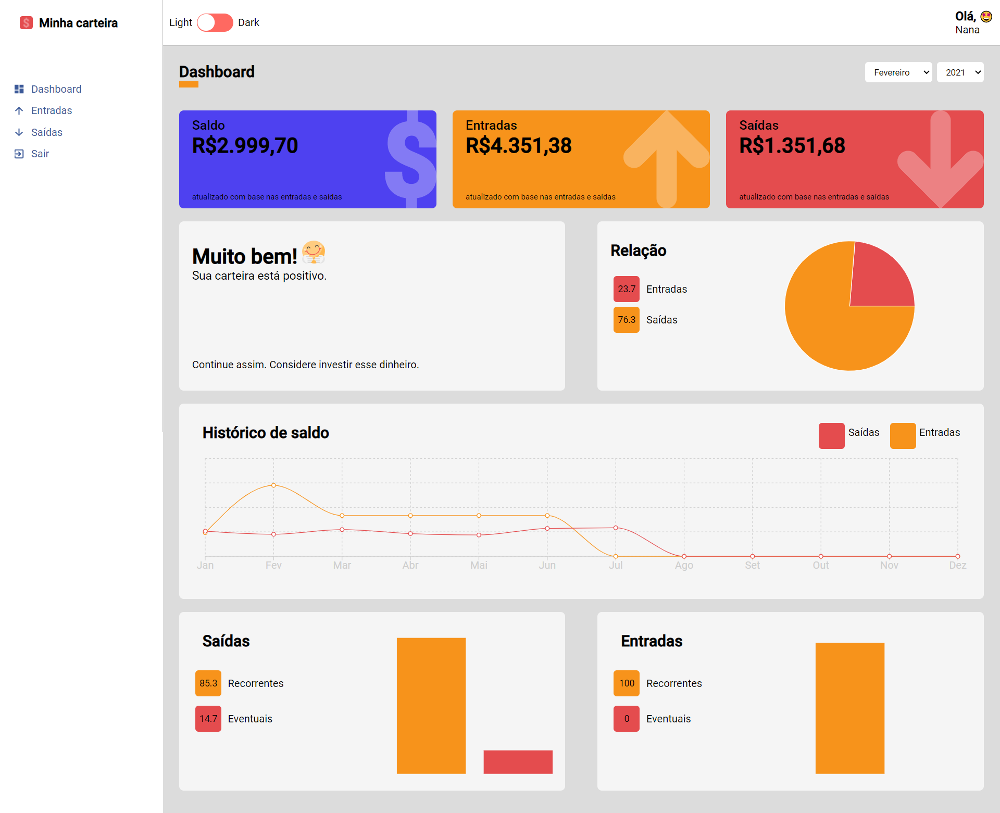
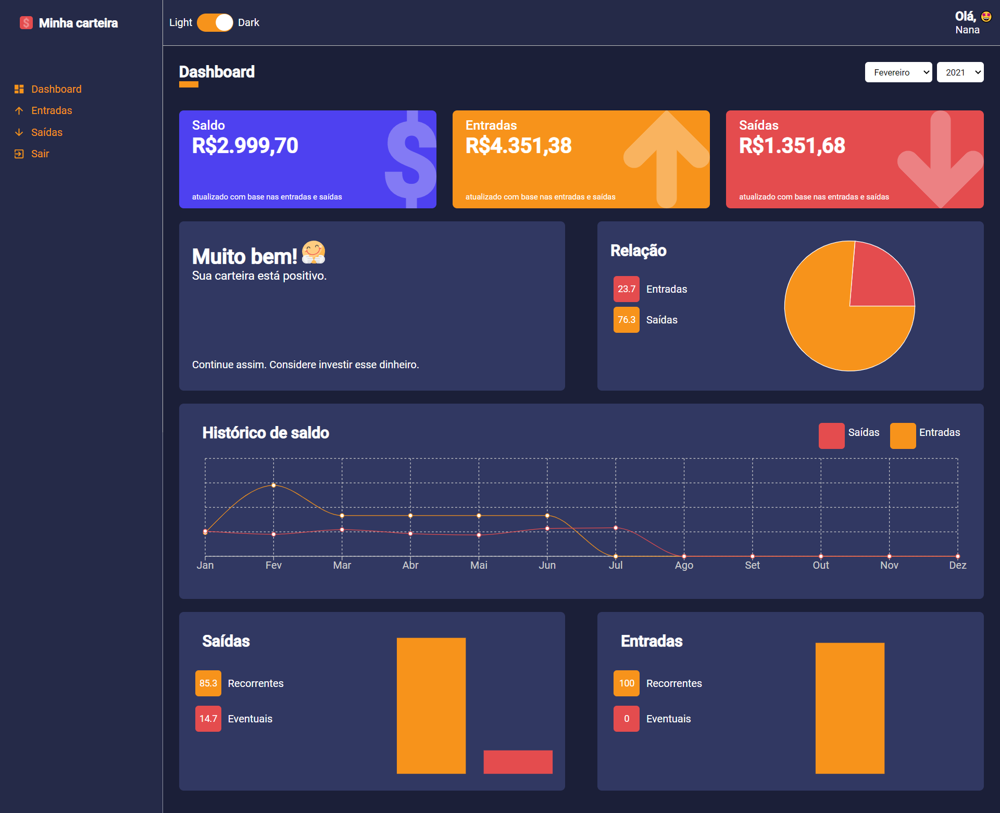
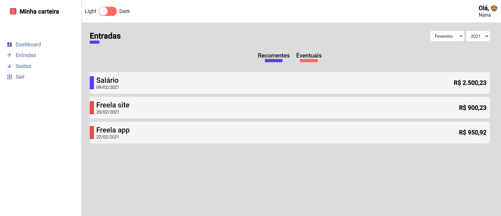

# Minha Carteira

Aplicação realizada com objetivo de aprender mais sobre front-end.
- Controle de finanças.
- Gráficos que tornam a visualização mais interessante.

## Tecnologias usadas:

- React (hooks)
- Typescript
- Recharts

### Imagens da Aplicação:
- Tela de Dashboard
Uso de Contexto api para alterar as cores para claro:

Uso de Contexto api para alterar as cores para escuro:

-Tela de listagem:

